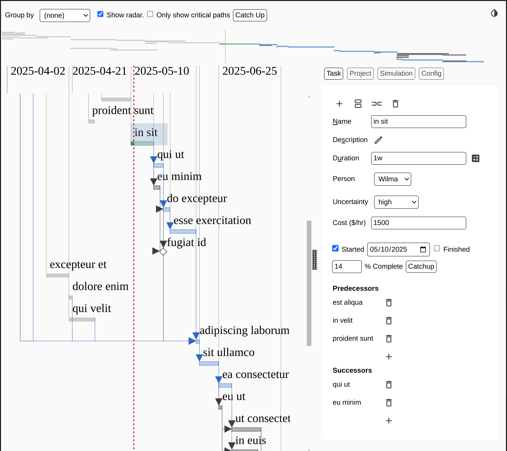

# Explan

Create and edit Gantt charts directly in VS Code.

To start create an empty file with an extension of `.explan`, `.explan.json`, or
`.explan.png` and open it in Visual Studio Code.

Or run the `Explan: Create new Explan Document` action.

Press `Shift-Ctrl-H` to display all the keyboard shortcuts.

## Features

- Plans can be stored in either JSON format (`*.explan` or `*.explan.json`) or
  as PNG files (`*.explan.png`).
- Regardless of the format the charts can always be reopened and edited.
- Add your own resource and metric definitions.
- Durations are entered in human-centric notation, e.g. `2w3d` is two weeks and
  3 days.
- Easily split or duplicate tasks.
- Fast Fuzzy search to jump to task `Ctrl-F` or `Shift-Ctrl-F`.
- Radar allows quick zooming into parts of the chart.
- Double-click on a task in the chart to zoom into that task, showing only its
  predecessors and successors.
- Simulate possible project timelines based on the Uncertainty set for each
  task, allowing the discovery of hidden critical paths.
- Group tasks by resource, for example to show what each person is working on.

### Darkmode

Supports both dark mode and light mode:

## Requirements

None.

## Release Notes

### 0.0.5

- Reverted the New Task button to it's old location.
- Added search button to the task panel.

### 0.0.4

- Change button background when :active.
- Don't shorten task completion when using Catchup.
- Move the new task button out of the Task panel to the top bar.
- Use 'click' events on canvas, not 'mousedown`. Fixes a bug where changing
  values didn't always get saved.
- Do not show Start and Finish on dependencies panel since they are added and
  removed automatically and that can't be done manually.
- Add input color-scheme: dark and reset tabindex=-1 for search results which
  disallows tabbing to move through the search results.
- Add cancel button to predecessor and successor dialogs.
- Bring back zoom button.
- Show which resource value is the default.
- Increment new task names to make it easier to distinguish which one was just
  added.
- Display human durations on the simulation panel.
- Add outline to the focused item in task-search-control to make it easier to
  know which one is selected.
- The Catchup button should only appear if the project is "started".
- Use a different pattern for tasks on the critical path to better distinguish
  them.
- Force focus onto the "Task" tab when searching.

### 0.0.1

Initial release.
